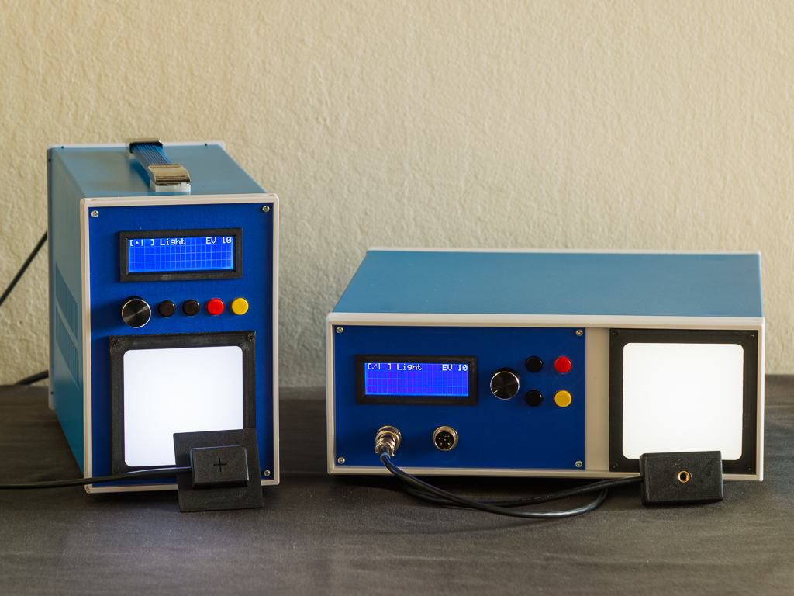

# Film Camera Tester

The idea of using Arduino for measuring camera shutter timings is not new. What I've tried to do here, is to make a modular system with a set of features normally offered in professional testers, at the same time to keep its design simple and available to reproduce using off-the-shelf components.

Usually, time counting and/or light integration methods are used to test cameras. For the time counting method, you need a light sensor, a time counter, and a simple light source. With such setup you can measure exposure time(s) provided by a shutter, curtains travel speed of a focal plane shutter, flash sync contact delays, etc.
For the second method, you'll need a photosensor able to measure the amount of light and a calibrated light source. With such setup, you'll be able to measure actual exposure produced by a system "camera+lens", light meter accuracy, operation of auto-exposure cameras, etc.

This tester allows you to perform both time-based and light integration tests and calibrations of film cameras.

### Features and characteristics

- Measures actual exposure at the film plane, which allows to test fully automatic, aperture or shutter priority cameras.
  - Accuracy ±0.05EV within 6-14EV range, although full range 5-17EV of a Light Unit can be used for testing.
  - Resolution 0.01EV
- Measures exposure time at the center of a frame of simple (leaf) and focal plane shutters of 35mm and Medium Format (6x6 or 6x45 using adapter) cameras.
  - In v2.7 only: For leaf shutters of size #00 and #0 calculates estimated effective speed according to efficiency curve.
- Measures timings of focal plane shutters with curtains traveling vertically or horizontally.
  - Results can be represented in a few different ways to help you detect different flaws in a shutter operation, such as curtains capping or tapering, uneven travel speed, etc.
  - Automatically re-calculates curtains travel time according to selected frame width or height.
- Measures delays between flash contact and shutter opening.
  - Automatically identifies X, M, or FP modes.
- Takes a series of measurements, and calculates average stats.
  - Number of tests in series can be selected in the Settings menu between 3, 5, 10, or 20.
- Allows to measure efficiency thus effective speed of a leaf shutters from size #00 and bigger.
- Automatically detects the type of connected Sensors, and notifies you if wrong sensor is connected for a specific Mode.
- Automatically detects target speed used to calculate the error.
  - Target speed can be set to "Auto" or pre-set from a list of standard speeds.
  - You also can select between two sets of standard speeds (Old style like 1/50 or New style like 1/60), depending on the type of shutter you are testing.
- Range of measured speeds from 1s to 1/8000
- Accuracy 10µs (measured in the pre-set environment, using a signal generator and specialized light source)
  - Accuracy may vary during real-life measurements with different light sources and cameras.
- Allows to check accuracy and calibrate light meters and light meters built into a cameras.
  - Light Source brightness is adjustable within 5-17EV range
  - Light Source can be switched between K12.5 and K14.03 light levels

More information on [Wiki](https://github.com/srozum/film_camera_tester/wiki).

### Buy or DIY

Since the SRT-2 Kits (assembled or not assembled), which were offered on my Tindie store, are all sold and will not be produced anymore, your only option is to make it yourself.

In '/assets' folder you can find all schematics, PCB production files, and STLs for 3D printed parts necessary to build the Tester. I recommend you carefully read Wiki pages first, explore schematics and product photos before you start ordering the parts.

### Big Thanks to

Big thanks to everyone who supported the project from the beginning.

Similar projects that helped me to start my own

 - [https://github.com/cameradactyl/Shutter-Timer](https://github.com/cameradactyl/Shutter-Timer)
 - [https://github.com/ianonahillroad/CameraShutterTimer](https://github.com/ianonahillroad/CameraShutterTimer)
 - [https://github.com/c-s-1/shutter-tester](https://github.com/c-s-1/shutter-tester)
 - [https://github.com/sokol07/LaserShutterTester](https://github.com/sokol07/LaserShutterTester)

---
This work is licensed under a [Creative Commons Attribution-ShareAlike 4.0 International License][cc-by-sa].

[![CC BY-SA 4.0][cc-by-sa-image]][cc-by-sa]

[cc-by-sa]: http://creativecommons.org/licenses/by-sa/4.0/
[cc-by-sa-image]: https://licensebuttons.net/l/by-sa/4.0/88x31.png
